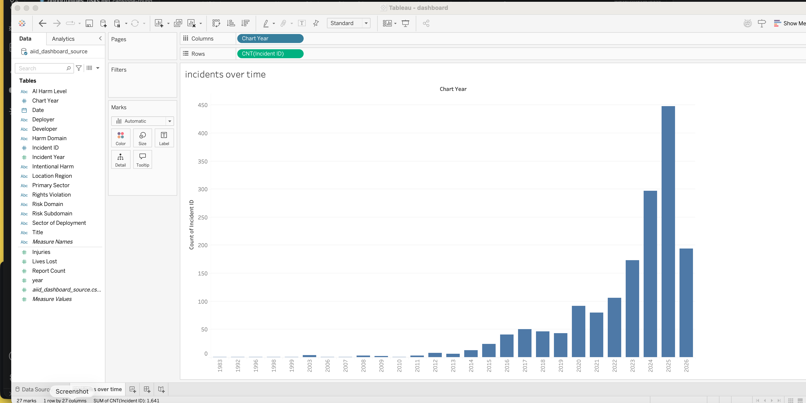
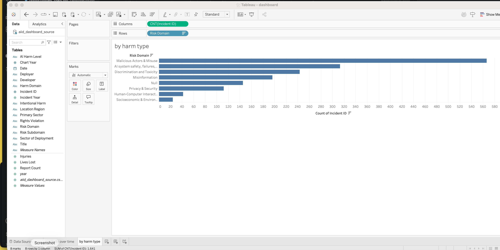
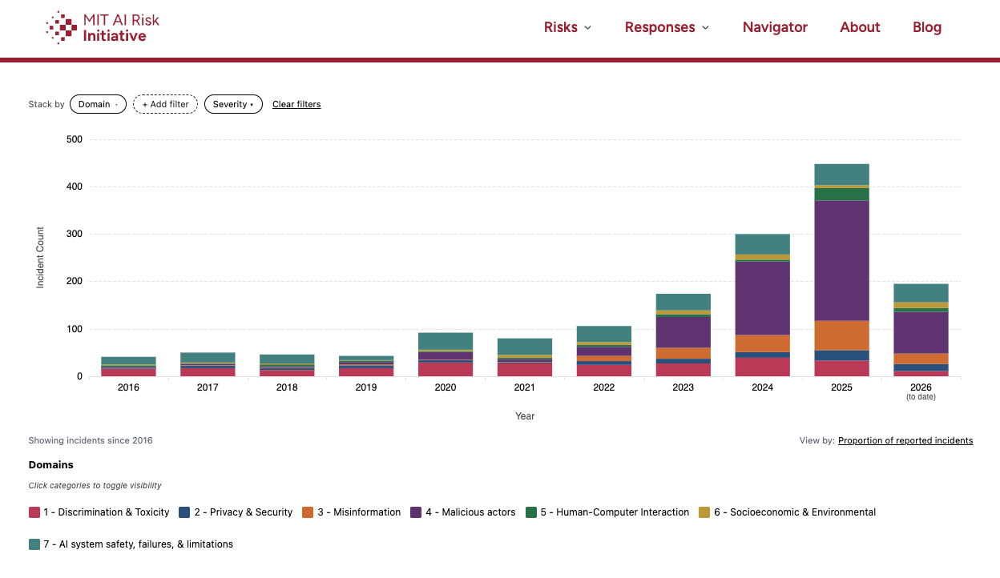
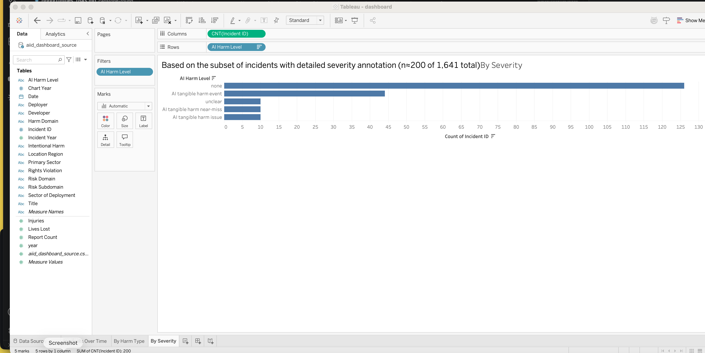
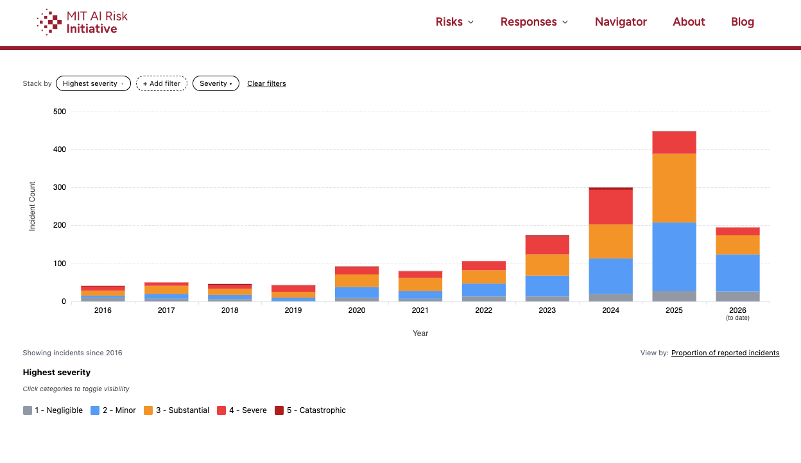
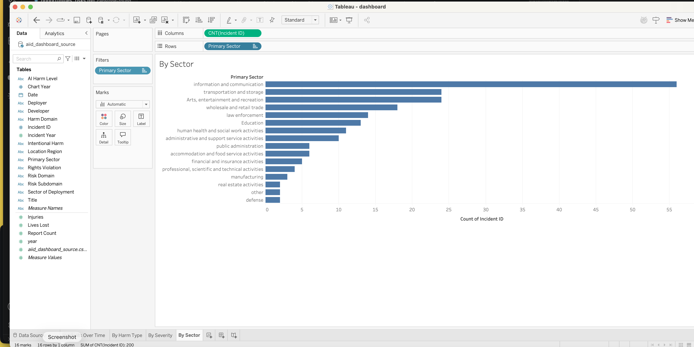

# Dashboard Documentation

Built in Tableau, not PowerBI, since PowerBI Desktop does not run on Mac. Workbook: `dashboard/dashboard.twbx`.

## Data source

AI Incident Database (incidentdatabase.ai), weekly Excel export, downloaded 2026-08-28. 1,641 documented
AI incidents. Cleaned and exported to `data/aiid_dashboard_source.csv`. Two known limitations of the
source data, both stated here rather than hidden:

- Deployment sector is tagged on roughly 206 of 1,641 incidents. The sector chart below is filtered to
  those tagged incidents only.
- Detailed severity annotation (AI Harm Level, Intentional Harm, Rights Violation) exists for roughly
  200 of 1,641 incidents, a single hand-reviewed subset shared across all three fields. The severity
  chart below is filtered to that subset and labeled accordingly.

## View 1: Incidents Over Time

All 1,641 incidents by year. Uses the database's `year` field, the more complete of two year fields in
the source data. Shows a sharp climb from 2020 onward, the core visual argument for why audit-before-
automate matters now.

## View 2: By Harm Type

All 1,641 incidents by Risk Domain (8 categories). Malicious Actors & Misuse leads at 566, followed by
AI system safety/failures at 313, Discrimination and Toxicity at 243.

**Independent corroboration:**

Source: MIT AI Risk Initiative, AI Incident Tracker, airisk.mit.edu/ai-incident-tracker, stacked by
Domain. Data licensed CC BY 4.0. Same underlying incident set, same leading category, Malicious Actors,
with the added detail that the pattern is accelerating sharply from 2023 to 2025.

## View 3: By Severity

Filtered to the ~200 incidents with detailed severity annotation, stated plainly on the sheet itself.

**Independent corroboration:**

Source: MIT AI Risk Initiative, AI Incident Tracker, airisk.mit.edu/ai-incident-tracker, stacked by
Highest Severity. Data licensed CC BY 4.0. This is a full-coverage severity view across all incidents
since 2016, unlike this project's own severity chart, which is limited to the ~200-incident annotated
subset in the AIID source file. Included specifically to give a fuller severity picture than the
primary dataset alone supports.

## View 4: By Sector

Filtered to the ~206 incidents with a tagged deployment sector. Information and communication leads,
followed by transportation and storage.

**No corroborating view for sector.** MIT's Incident Tracker does not classify incidents by deployment
sector. No corroborating chart is included for this view for that reason, stated plainly rather than
substituting a mismatched filter.

## View 5: Total Documented Incidents

Headline KPI tile added at the top of the dashboard. Shows 1,641 total AI incidents tracked, pulled from the AI Incident Database. See screenshot below.
(images/Dashboard.png)

## On MIT as a source, generally

The MIT AI Risk Initiative runs its own LLM-based classification pipeline over the same underlying AIID
incident reports, independently tagging risk domain and a 1-to-5 severity scale across the full incident
set, not a subset. This is a separate classification effort, included here as corroboration, not as this
project's primary dataset. MIT's own team states the analysis is a proof-of-concept and that patterns
should be treated as indicative, not definitive, a caveat carried over here as well.